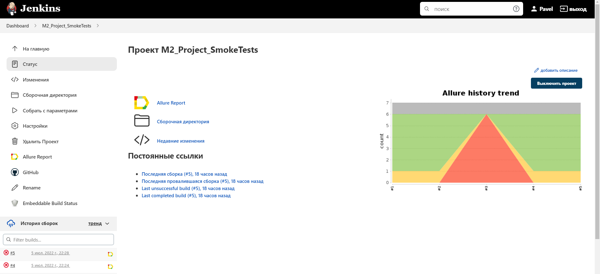
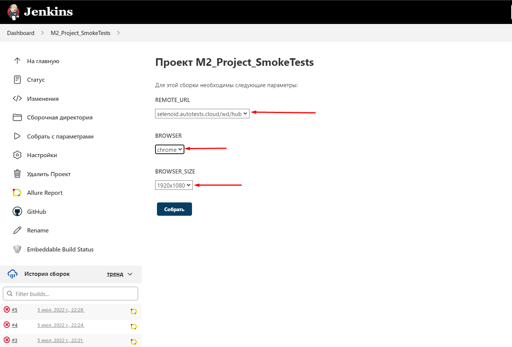
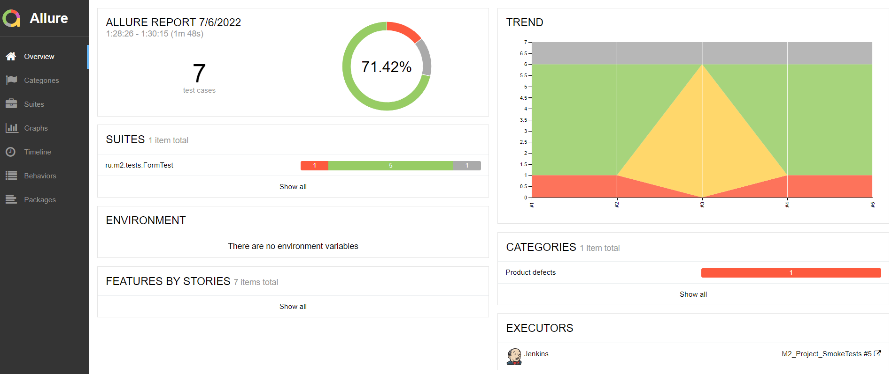
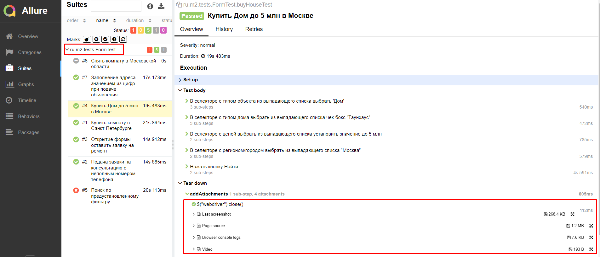
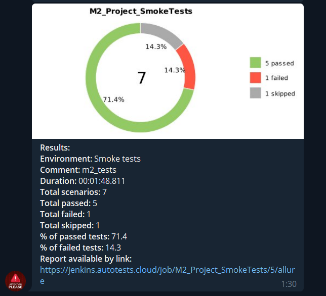
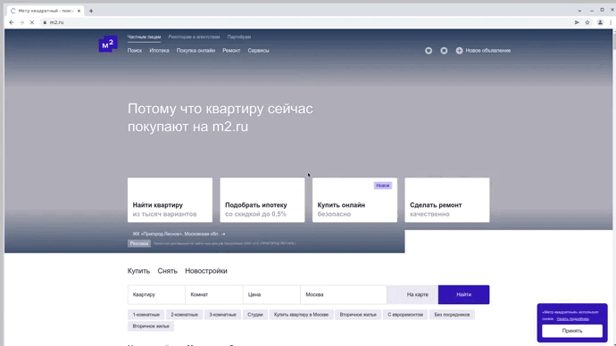

## Проект автоматизации тестирования веб-приложения "Метр квадратный"

---
### Потому что квартиру сейчас покупают на [m2.ru](https://m2.ru/)
<a id="anchor"></a>

:closed_book: __Содержание__
+ [Технологии и инструменты](#instruments)
+ [Пример Smoke тестов](#smoke)
+ [Сборка в Jenkins](#jenkins)
+ [Запуск из терминала](#terminal)
+ [Allure отчётность](#report)
+ [Отчет в Telegram](#tg)
+ [Видео примера прохождения теста](#video)


:toolbox:<a name="instruments"></a>__Технологии и инструменты__


---
<a name="smoke"></a>__Пример Smoke тестов__

:white_check_mark: _Позитивные проверки:_

- [ ]  Купить комнату в Санкт-Петербурге
- [ ]  Подача заявки на консультацию с неполным номером телефона
- [ ]  Открытие формы оставить заявку на ремонт
- [ ]  Купить Дом до 5 млн в Москве
- [ ]  Поиск по предустановленному фильтру (Пример проваваленного теста)

---

:x: _Негатитвные проверки_
- [ ] Подача заявки на консультацию с неполным номером телефона 
- [ ] Заполнение адреса значением из цифр при подаче обьявления
---
:toolbox:<a name="jenkins"></a>__Сборка в Jenkins__

[Проект M2_Project_SmokeTests](https://jenkins.autotests.cloud/job/M2_Project_SmokeTests/)





__Параметризированная сборка в Jenkins__

Мы можем собрать задачу с предложенными параметрами, выбрав из выпадающих вариантов:



---
:computer:<a name="terminal"></a>__Запуск из терминала__

Локальный запуск теста:

```
gradle clean test  
```
Удаленный запуск теста:
```
clean
vacancy
-DremoteUrl=${REMOTE_URL}
-Dbrowser=${BROWSER}
-DbrowserSize=${BROWSER_SIZE}
```

---
:bar_chart:<a name="report"></a>__Allure отчётность__



Проведенные тесты с шагами, возможностью просмотра скриншота, лога и видео



---
:incoming_envelope:<a name="tg"></a>__Отчёт в Telegram__



Кроме красочной инфографики доступна возможность перейти по ссыле для просмотра отчета:
[просмотреть сейчас ](https://jenkins.autotests.cloud/job/M2_Project_SmokeTests/5/allure/)

---
:clapper:<a name="video"></a>__Видео примера прохождения теста__

Запуск проходит на удаленном веб-драйвере Selenoid


:arrow_up: [Вверх страницы](#anchor)

:new_moon_with_face: <a target="_blank" href="https://t.me/BiLLGradLe">t.me/BiLLGradLe</a>

---


